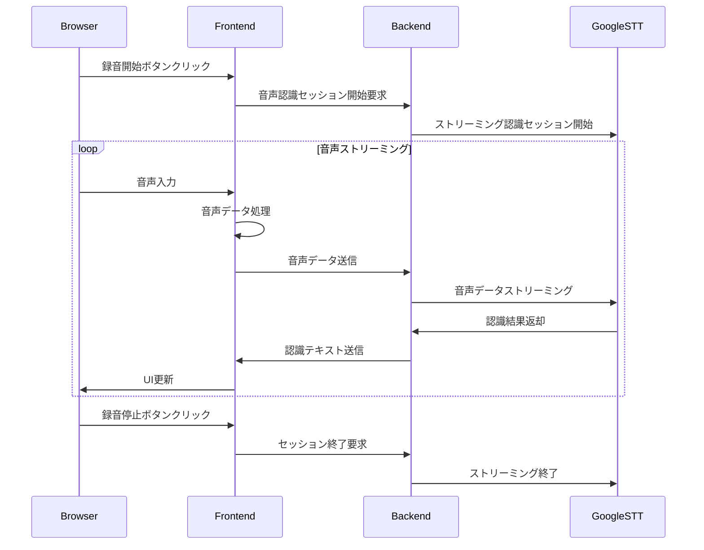

```mermaid
sequenceDiagram
    participant Browser
    participant Frontend
    participant Backend
    participant GoogleSTT

    Browser->>Frontend: 録音開始ボタンクリック
    Frontend->>Backend: 音声認識セッション開始要求
    Backend->>GoogleSTT: ストリーミング認識セッション開始

    loop 音声ストリーミング
        Browser->>Frontend: 音声入力
        Frontend->>Frontend: 音声データ処理
        Frontend->>Backend: 音声データ送信
        Backend->>GoogleSTT: 音声データストリーミング
        GoogleSTT->>Backend: 認識結果返却
        Backend->>Frontend: 認識テキスト送信
        Frontend->>Browser: UI更新
    end

    Browser->>Frontend: 録音停止ボタンクリック
    Frontend->>Backend: セッション終了要求
    Backend->>GoogleSTT: ストリーミング終了
```