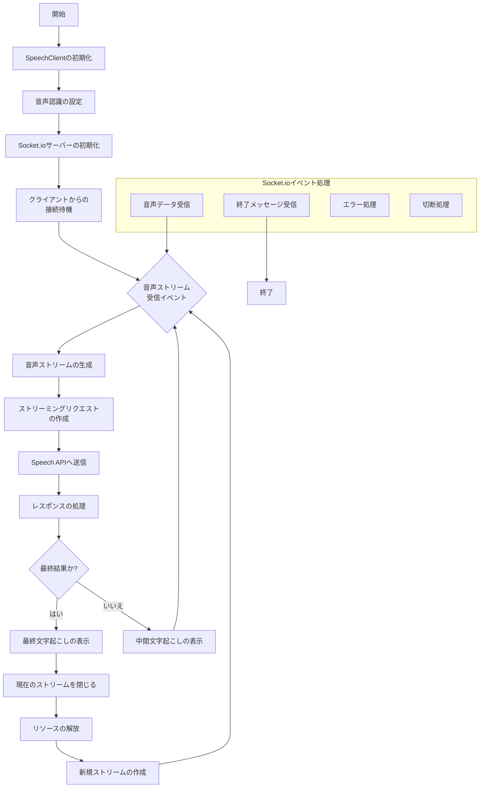

```mermaid
graph TD
    A[開始] --> B[SpeechClientの初期化]
    B --> C[音声認識の設定]
    C --> D[Socket.ioサーバーの初期化]
    
    D --> E[クライアントからの\n接続待機]
    
    E --> F{音声ストリーム\n受信イベント}
    F --> G[音声ストリームの生成]
    G --> H[ストリーミングリクエストの作成]
    H --> I[Speech APIへ送信]
    I --> J[レスポンスの処理]
    
    J --> K{最終結果か?}
    K -->|はい| L[最終文字起こしの表示]
    K -->|いいえ| M[中間文字起こしの表示]
    
    L --> P[現在のストリームを閉じる]
    P --> Q[リソースの解放]
    Q --> R[新規ストリームの作成]
    
    M --> F
    R --> F
    
    subgraph "Socket.ioイベント処理"
        S[音声データ受信]
        T[終了メッセージ受信]
        U[エラー処理]
        V[切断処理]
    end
    
    T --> W[終了]
    
    %% Socket.ioイベントの関連付け
    S --> F
```